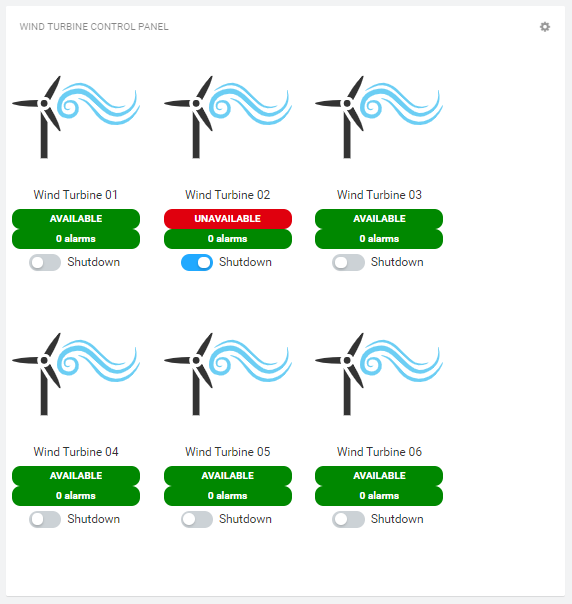
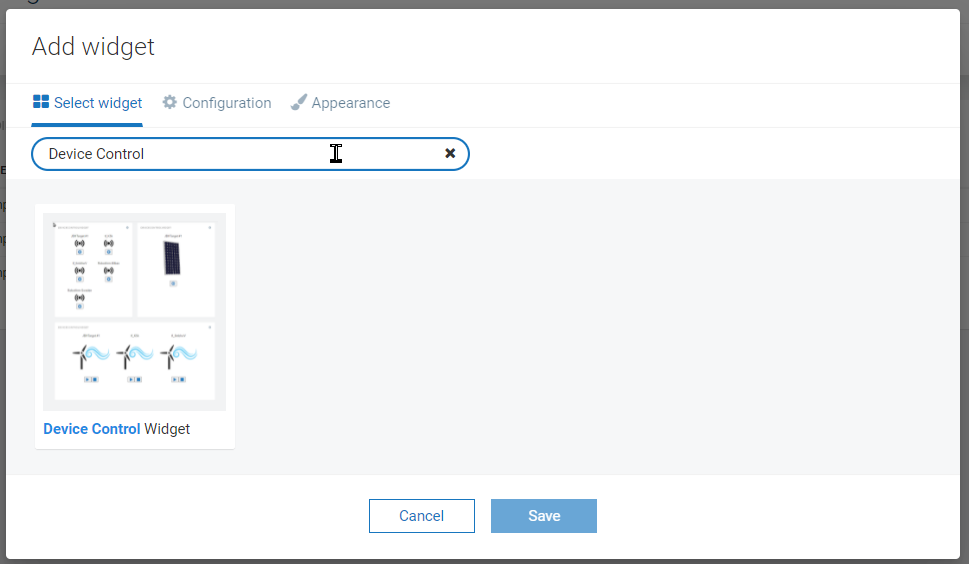
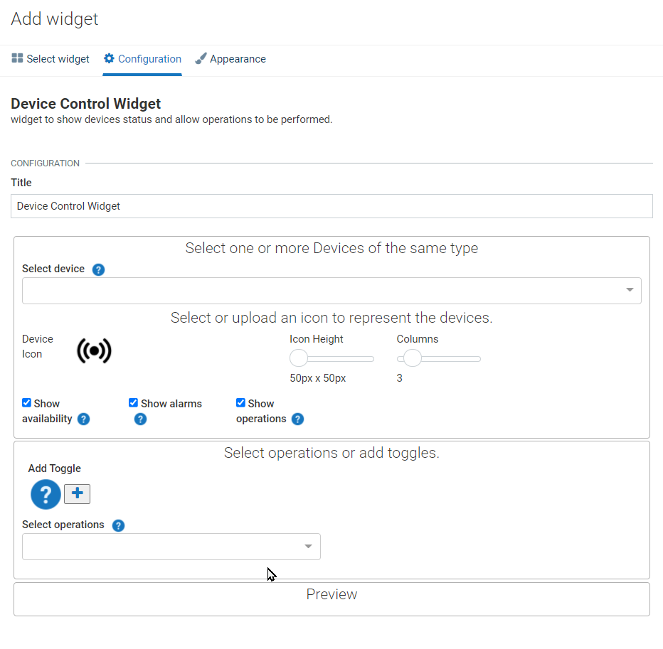
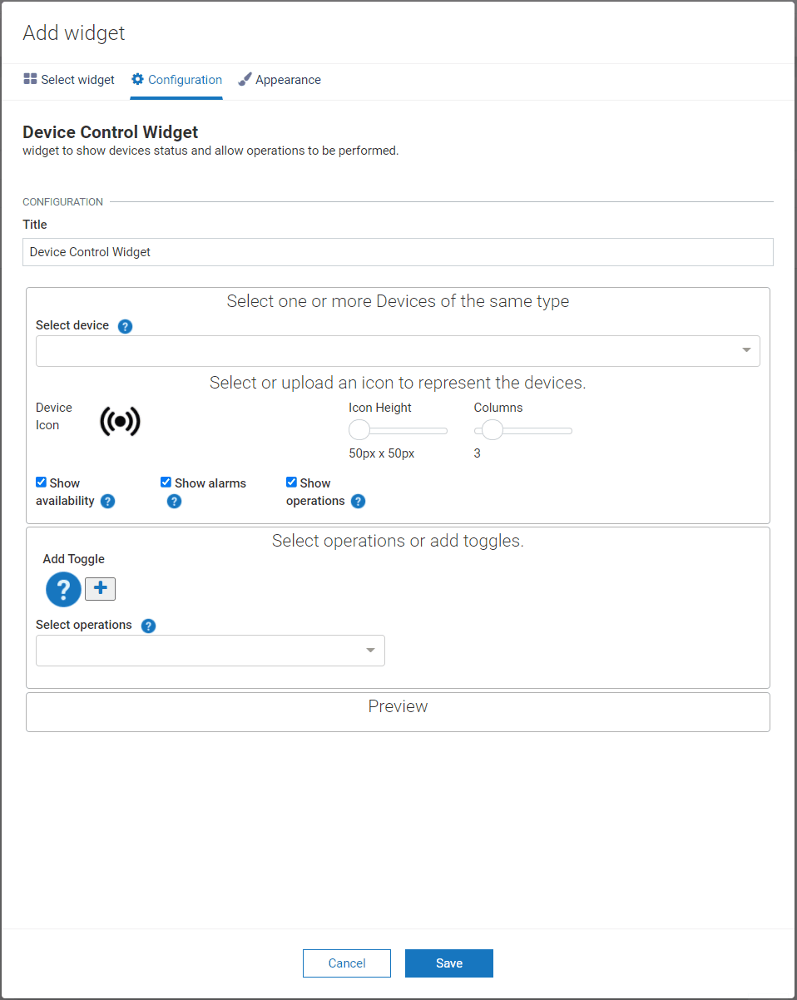
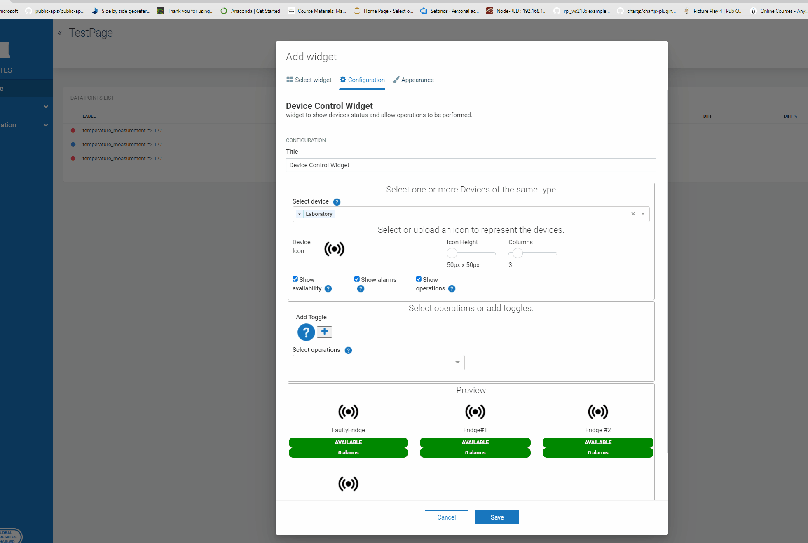
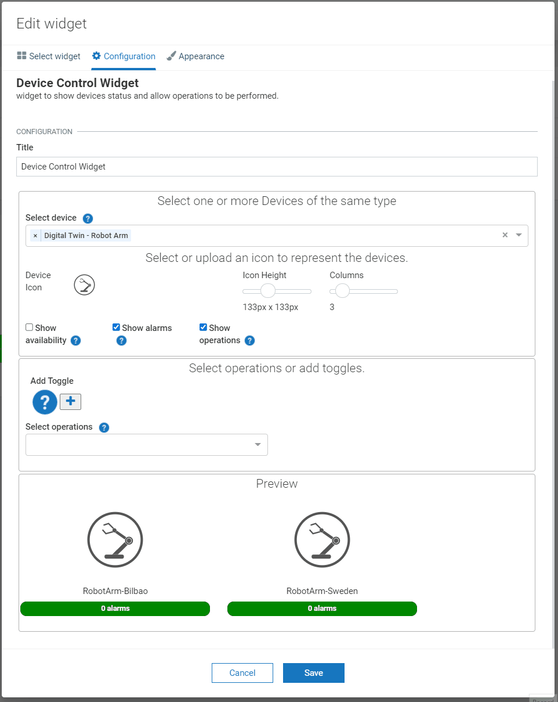
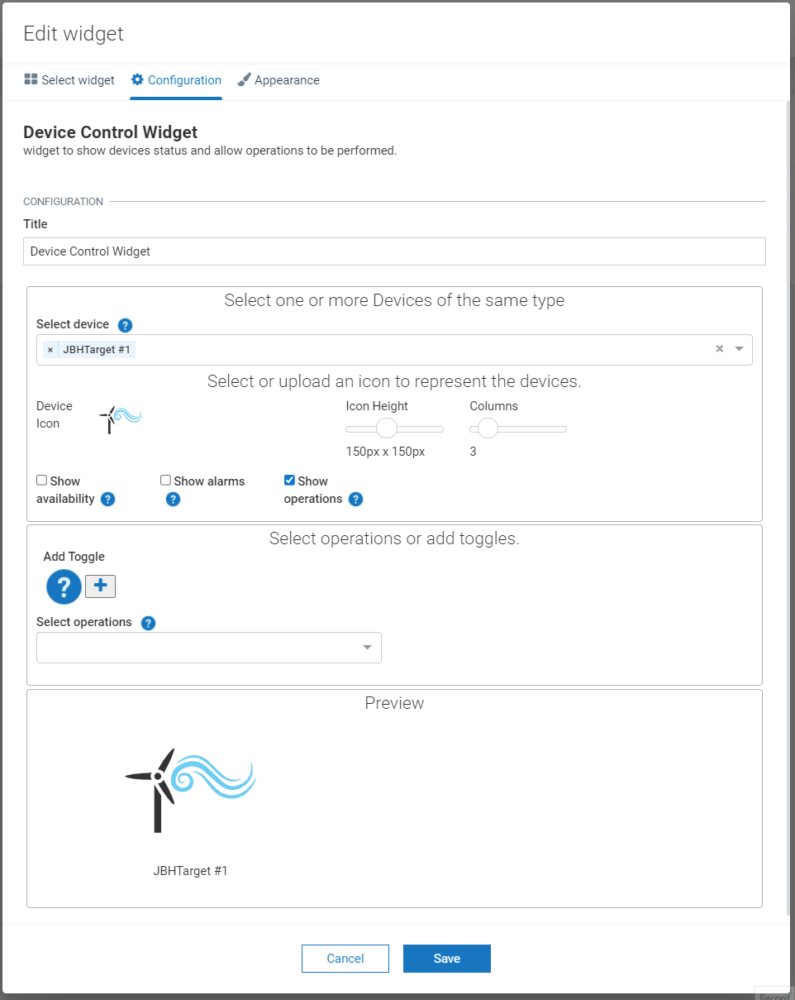
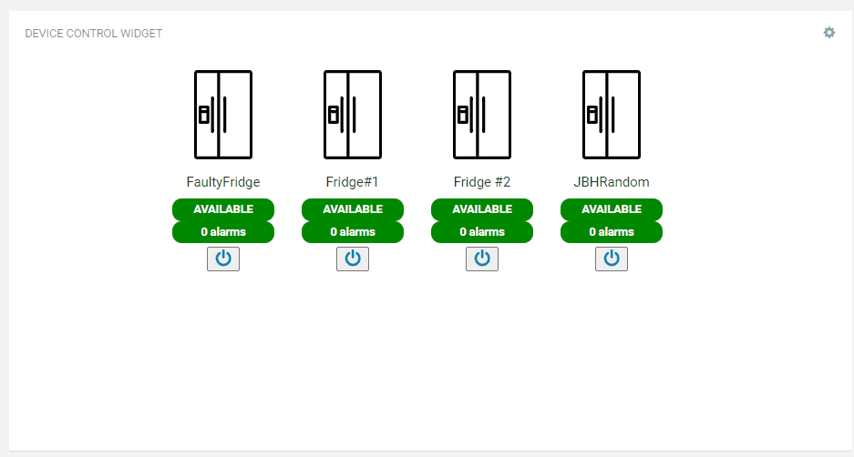
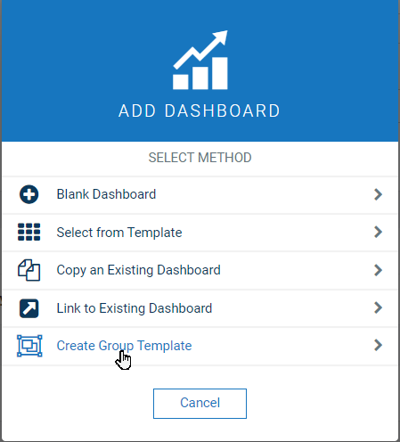
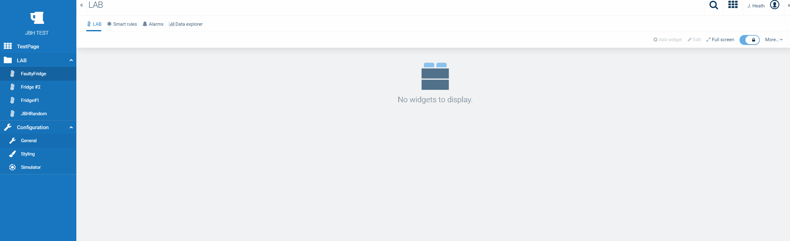

<!-- @format -->

# Device control and status widget [](https://github.com/SoftwareAG/cumulocity-datapoints-charting-widget/releases/download/v1.0.1/device-control-widget-1.0.1.zip)



## Features

-   the user can select groups and individual devices.
-   the user can use images (including vector graphics) to represent the devices.
-   select operations and define tooltips, and payload for each.
-   Toggling of flags on the managed object supported.
-   Supports group template dashboard

## Installation

### Runtime Widget Deployment?

-   This widget supports runtime deployment. Download the [Runtime Binary](https://github.com/SoftwareAG/cumulocity-datapoints-charting-widget/releases/download/v1.0.1/device-control-widget-1.0.1.zip) and follow runtime deployment instructions from [here](https://github.com/SoftwareAG/cumulocity-runtime-widget-loader).

## User guide

This guide will teach you how to add the widget in your existing or new dashboard.

NOTE: This guide assumes that you have followed the [installation](https://github.com/SoftwareAG/cumulocity-runtime-widget-loader) instructions

1. Open the Application Builder application from the app switcher (Next to your username in the top right)
2. Add a new dashboard or navigate to an existing dashboard
3. Click `Add Widget`
4. Search for `Device Control`
5. See below for the configuration options



The widget configuration page contains a number of configuration attributes.



-   **Title** : Enter the title which will display at the top of your widget

**Device Options**

-   **Select device** : Choose a group of devices and/or individual devices to display on the widget. As you choose the Preview section will update to reflect your choices.



-   **Device icon** : click on the icon to change the displayed image for each device.

-   **Icon height** : use the slider to change the image display size.

-   **Columns** : use the slider to change how many devices will display side by side before wrapping.



-   **Show Availability** : check to show the current status of the device - based on the fragment `c8y_Availability`.

-   **Show alarms** : Check this option to display a pill containing the number of alarms for this device.

-   **Show operations** : Check this option to display the buttons to allow operations and toggles to be invoked.



**Select operations or add toggles**

> N.B. "toggles" are a name for a mechanism the widget provides to flip a boolean fragment on the Managed Object that represents the device. It is intended to be a generic mechanism to help demos, but may well have utility in other areas.

-   **Select operations** : if the selected devices have the `c8y_SupportedOperations` fragment then the list will be displayed here. The list will be a composite of the `c8y_SupportedOperations` fragments from all selected devices with duplicates removed.

After selecting an operation a column of options for the operation will appear.

-   **Display Name** : This is a tool tip which will be displayed when you mouse over the operation on the widget.

-   **Button icon** : select an icon from the font awsome 4 list of icons to represent the selected operation.

-   **payload** : this is an arbitrary string or payload (json) that will be sent in the operation. Typically the payload can be anything but is the value of a fragment of the operation object that will be sent. a code representation is shown below but the contents of the field will depend wholly on what operation the user selects and what it expects. See [Cumulocity create](http://resources.cumulocity.com/documentation/websdk/client/classes/operationservice.html) section for more details

```
    //this is an example for supplorted operation 'myOperation'
    //deviceId is supplied by the widget
    let operation: IOperation = {
        deviceId: xxxxxx,
        myOperation: <payload field contents>
    }
```

-   **Add toggle** : Clicking this will add a column, similar to the one added by selecting a command above. However the fields are slightly different.



The following shows the widget responding to the change in managed object flag state. because it has the `c8y_Availability` when the fragment `sag_IsShutDown` is toggled to true (and its status is available) the device shows as being in standby. 



**Group template**

You can use this widget with a group template dashboard:



for example the Laboratory group in my examples above:


Now each page can have a widget that displays the device linked to the route selected. 




---

These tools are provided as-is and without warranty or support. They do not constitute part of the Software AG product suite. Users are free to use, fork and modify them, subject to the license agreement. While Software AG welcomes contributions, we cannot guarantee to include every contribution in the master project.

---

For more information you can Ask a Question in the [Tech Community Forums](https://tech.forums.softwareag.com/tags/c/forum/1/Cumulocity-IoT).

You can find additional information in the [Software AG Tech Community](https://techcommunity.softwareag.com/en_en/cumulocity-iot.html).
