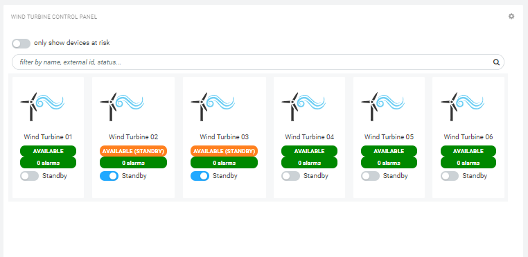
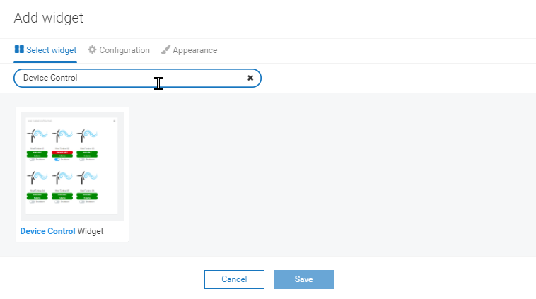
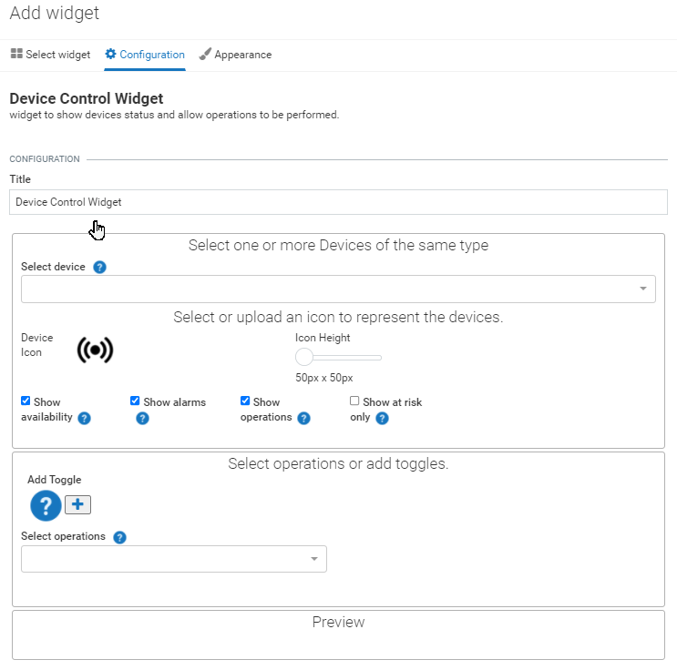
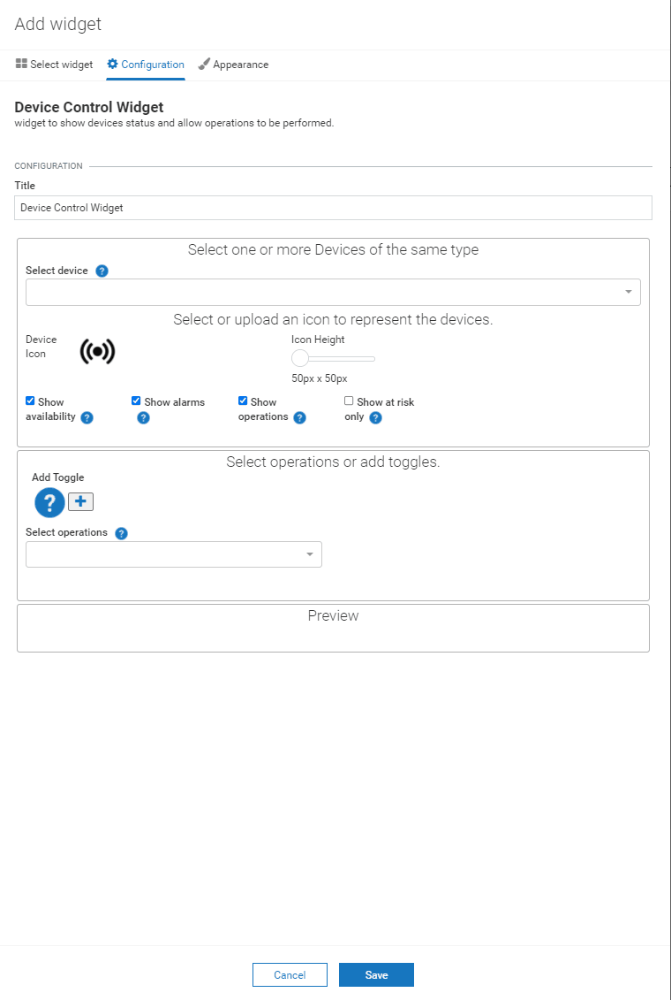
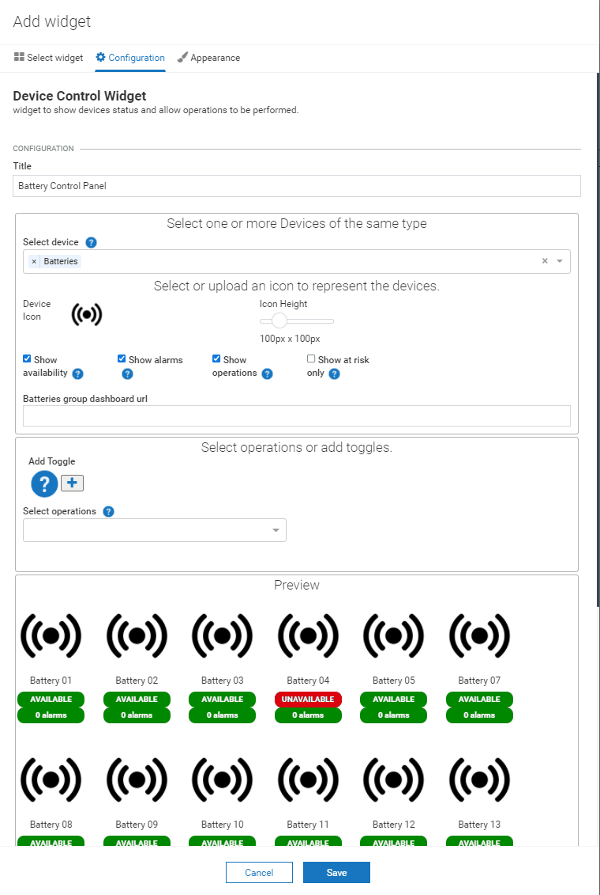

<!-- @format -->

# Device control and status widget 

## Features

-   the user can select groups and individual devices.
-   the user can use images (including vector graphics) to represent the devices.
-   select operations and define tooltips, and payload for each.
-   Toggling of flags on the managed object supported.

## Installation

### Runtime Widget Deployment?

-   This widget supports runtime deployment. Download the [Runtime Binary](https://github.com/SoftwareAG/cumulocity-datapoints-charting-widget/releases/download/v1.0.1/device-control-widget-1.0.1.zip) and follow runtime deployment instructions from [here](https://github.com/SoftwareAG/cumulocity-runtime-widget-loader).

## User guide

This guide will teach you how to add the widget in your existing or new dashboard.

NOTE: This guide assumes that you have followed the [installation](https://github.com/SoftwareAG/cumulocity-runtime-widget-loader) instructions

1. Open the Application Builder application from the app switcher (Next to your username in the top right)
2. Add a new dashboard or navigate to an existing dashboard
3. Click `Add Widget`
4. Search for `Device Control`
5. See below for the configuration options

The widget configuration page contains a number of configuration attributes.

-   **Title** : Enter the title which will display at the top of your widget

**Device Options** section

-   **Select device** : Choose a group of devices and/or individual devices to display on the widget. As you choose the Preview section will update to reflect your choices.

-   **Device icon** : click on the icon to change the displayed image for each device.

-   **Icon height** : use the slider to change the image display size.

-   **Columns** : use the slider to change how many devices will display side by side before wrapping.

---

These tools are provided as-is and without warranty or support. They do not constitute part of the Software AG product suite. Users are free to use, fork and modify them, subject to the license agreement. While Software AG welcomes contributions, we cannot guarantee to include every contribution in the master project.

---

For more information you can Ask a Question in the [Tech Community Forums](https://tech.forums.softwareag.com/tags/c/forum/1/Cumulocity-IoT).

You can find additional information in the [Software AG Tech Community](https://techcommunity.softwareag.com/en_en/cumulocity-iot.html).
